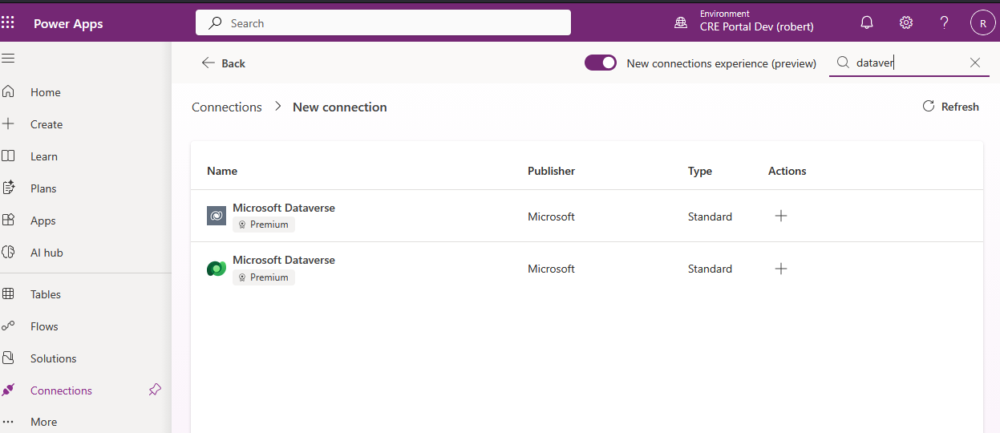
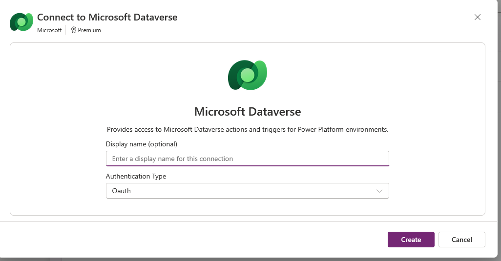
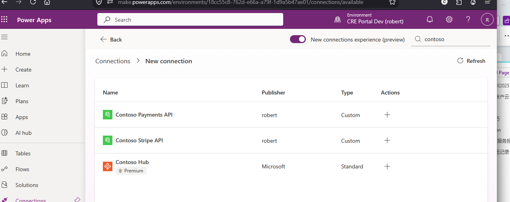
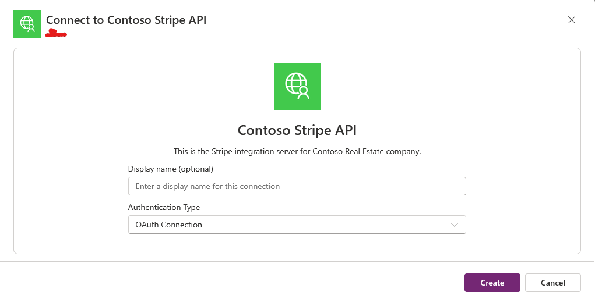
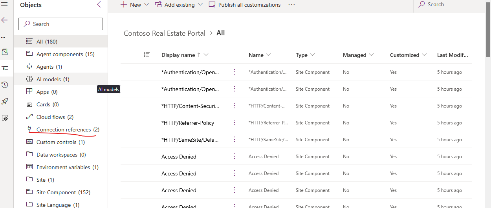
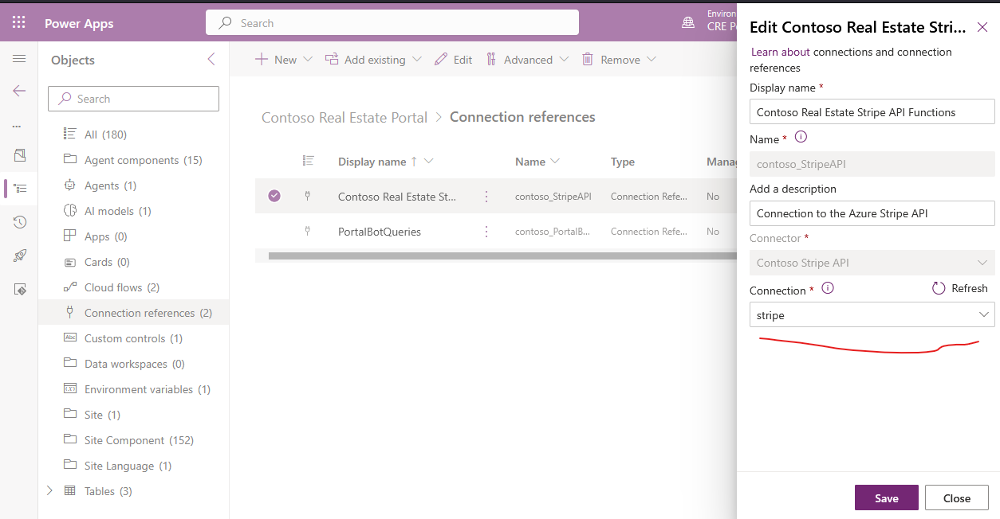
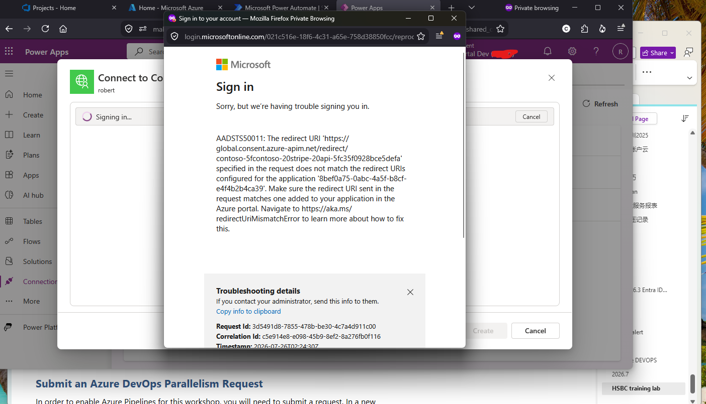
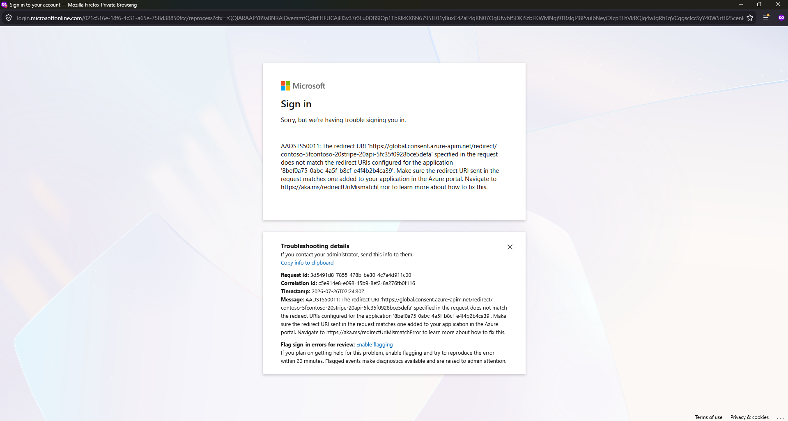

# 🌐Contoso Real Estate Portal Solution 

The source for the Portal solution is built using:

- Power Pages
- Power Apps Component Framework
- Copilot Studio

> [!NOTE]
> For a full end-to-end set of instructions on how to install prerequisites, clone, build, deploy, and test the solutions, refer to [full-development-setup-instructions.md](./docs/00-full-development-setup-instructions.md).


## ✅Pre deployment configuration

The following tasks must be carried out before you import that `ContosoRealEstatePortal` solution

### 🤖Turn off Automatic Copilot Creation for Power Pages

When a power pages site is created, by default a new Copilot will be created and the `SiteComponent` with type `BotConsumer` will be updated to point to the new copilot. This interferes with the CI/CD process. As a work around the the `enableChatbotOnWebsiteCreation` Tenant setting should be turned off using the Power Platform admin PowerShell:

```powershell
$requestBody = @{
        powerPlatform = @{
            powerPages = @{
                enableChatbotOnWebsiteCreation = $false
            } 
        } 
    }

Set-TenantSettings -RequestBody $requestBody
```

For more information, see: https://learn.microsoft.com/en-us/power-pages/getting-started/enable-chatbot

The [powerpagesites.xml](\src\portal\solution\ContosoRealEstatePortal\src\Assets\powerpagesites.xml) contains a reference to the `BotConsumer` record via the `defaultbotconsumerid` field:

```xml
<powerpagesites>
  <powerpagesite powerpagesiteid="20f5d326-50b3-492b-aa2f-b29c913c932a">
    <content>
        {
        ...
        "defaultbotconsumerid":"102991e9-714b-ef11-a317-7c1e52150b3d"
        }
     </content>
...
</powerpagesites>
```

This is the id of the Power Pages Components that contains the schema name of the bot to use:

```xml
<powerpagecomponent powerpagecomponentid="102991e9-714b-ef11-a317-7c1e52150b3d">
  <content>
  {
  "botschemaname":
    "contoso_3c237b1a-7213-4759-b062-c6294730ec77",
    "configjson":"{\"skillConfigViewName\":\"Contoso Real Estate Portal bot Answers\"
  }"}
  </content>
 ...
</powerpagecomponent>
```

The schema name `contoso_3c237b1a-7213-4759-b062-c6294730ec77` refers to the bot that is deployed as part of the solution.

## ✅Deploying to a Development Environment to work on ContosoRealEstatePortal

Follow these steps to create a development environment:
- Install the dependency solutions `ContosoRealEstateCustomControls_managed.zip` and `ContosoRealEstateCore_managed.zip`
- Build the `ContosoRealEstatePortal.zip` solution from this repo source
- Import the built solution into the environment that you are currently authenticated with using `pac auth`
- Install reference and test data

### 🌱Create Your Developer Environment

To start contributing, you'll need to set up your developer environment.

1. Create a new developer Power Platform environment to work on the portal. This must be different from the `ContosoRealEstateCore` environment (unless you do not plan on checking in any changes and only want to test the solution). This is because the Portal solution takes a dependency on the managed layer below it.

1. Ensure you have all the updates installed via the Dynamics 365 apps page in the [admin portal](https://admin.powerplatform.microsoft.com/)

1. Run the script at `src\portal\solution\deployment-scripts\deploy-to-development-environment.ps1` and follow the instructions carefully. The script asks whether to download solution packages from GitHub releases in your own `origin` repository or build them locally. It clears `temp_releases` before preparing packages. If you choose GitHub releases, it downloads `ContosoRealEstateCustomControls_managed.zip`, `ContosoRealEstateCore_managed.zip`, and `ContosoRealEstatePortal.zip`, then skips local solution build. If you choose local build, the script warns that the build can take up to 20 minutes, then copies the generated managed dependency zips into `temp_releases` and deploys the locally built Portal solution.

### Building the solution without the deployment script

1. To build the solution use the following from a terminal inside VS Code:

   ```powershell
   cd <repo_root>
   ./scripts/build-release-packages.ps1 -Solution Portal
   ```

   If the build fails with `MSB3231: Unable to remove directory "obj\Release\Metadata"`, see [Solution Build File Lock Troubleshooting](08-solution-build-file-lock-troubleshooting.md).

1. Import the newly built `ContosoRealEstatePortal.zip` found at `<repo_root>/src/portal/solution/ContosoRealEstatePortal/bin`
   **IMPORTANT:** You must install the **unmanaged** version of the solution.

1. Install the reference and sample data using:

   ```powershell
   cd <repo_root>/src/core
   pac data import -d ./data/reference-data.zip
   pac data import -d ./data/sample-data.zip
   ```

## ✅Post deployment steps
Some settings are not possible to make during the solution import:

- Setup Connections for Connection References (this can be done using pac connection create)
- Creating a power pages web site to host the Portal that is deployed via the solution
- Configuring the Power Pages flow trigger to point to the newly imported cloud flows
- Configuring Authentication of the Copilot Studio copilot that is deployed to the Power Pages site.

### 🔌Core Post Deployment Set up
Run the Core solution post deployment setup script:

```powershell
src\core\solution\deployment-scripts\2-post-deployment-setup.ps1
```

This will:
- Reply URLs added to the Payments API Entra ID application registration to match the custom connectors
- Update the Plugin Managed Identity to match your azure deployment

### 🔌Create connections

The portal solution uses a couple of connections. When importing the solution manually you will be prompted to wire up the different connection references to an actual connection, but when using the deployment script you will need to create them after deployment. The CI/CD pipeline automatically associates the connection references to connections using the deploymentSettings.json

Note: You will need to have run the post deployment steps for the core solution to setup the reply urls for the connectors.

This can be done automatically in the CI/CD deployment pipeline using the `deploymentSettings.json` but is easiest done manually when working on your development environment.

Connection meaning:

- `Dataverse`: Used by Cloud Flows and Copilot Studio components in the portal solution to read and write Dataverse data.
- `Contoso Stripe API`: Used by Portal Cloud Flows that call the custom connector for Stripe-related payment operations.

Important: create these connections in the same Power Platform environment where you imported `Contoso Real Estate Portal` (for example, your `CRE Portal Dev` environment).

1. Open [make.powerapps.com](https://make.powerapps.com/) and switch to the target environment (top-right environment picker), for example `CRE Portal Dev`.
1. Open the `Contoso Real Estate Portal` solution
1. Open **Connection References**
1. Select each connection reference and select **+ New connection** under the **Connection** dropdown.
1. Search for the Connector type (Dataverse or Contoso Stripe API) and select the **+** add button, and then **Create**.
    - For **Microsoft Dataverse** (Connect to Microsoft Dataverse dialog):
         

         In the connector list, choose the **green Microsoft Dataverse** connector (the newer connector).

       - `Display name (optional)`: use a clear name such as `CRE Portal Dev - Dataverse - <your-user>`.
       - `Authentication Type`: keep the default `Oauth`.
       - Select **Create** and complete sign-in with the same user that has access to the current environment.

         

      Recommended values shown in this dialog:
      - Use the current environment shown at the top right in Power Apps (for example, `CRE Portal Dev (<your-user>)`).
      - Keep `Authentication Type` as `Oauth`.
      - Use a descriptive display name such as `CRE Portal Dev - Dataverse - <your-user>`.
    - For **Contoso Stripe API** (custom connector security dialog):
         

         In the connector list, choose **Contoso Stripe API** (custom connector).

         

         Recommended values shown in this dialog:
         - Use the current environment shown at the top right in Power Apps (for example, `CRE Portal Dev (<your-user>)`).
         - `Display name (optional)`: use a clear name such as `CRE Portal Dev - Contoso Stripe API - <your-user>`.
         - `Authentication Type`: keep the default `OAuth Connection`.
         - Select **Create** and complete the sign-in/consent prompt.

         Before creating this connection, make sure the connector security page is already updated with:
       - `Client ID`: `ENTRA_API_CLIENT_APP_ID` from your `.azure/<env>/.env`.
       - `Client secret`: run `./infra/scripts/show-payments-api-client-secret.ps1 -azureEnv <your-azure-env>` and paste the returned secret.
       - `Authorization URL`: `https://login.microsoftonline.com`.
       - `Tenant ID`: `AZURE_TENANT_ID` from your `.azure/<env>/.env`.
       - Save and select **Update connector** before creating the connection.
1. For production, SPNs will be used, however for development you can use your own account.
1. Return to the Connection References panel, select **Refresh**, and select the connection you have created (it will show as your login name)

   

1. Repeat for all connection references.
1. Navigate to Cloud Flows and select **Turn on** for each flow. (This isn't needed in CI/CD since the connection references are configured using the deploymentSettings.json and the flows are automatically turned on)

   

> [!WARNING]
> If creating the `Contoso Stripe API` connection fails with `AADSTS50011` (redirect URI mismatch), use the following fix.
>
> 
> 
>
> 1. Rerun `src/core/solution/deployment-scripts/2-post-deployment-setup.ps1`.
> 1. When prompted for redirect URLs, paste the redirect URL from each connector security page:
>    - `Contoso Payments API`
>    - `Contoso Stripe API`
> 1. Ensure each redirect URL is copied exactly as shown in the connector UI.
> 1. Retry creating the `Contoso Stripe API` connection.
>
> Manual fallback in Entra ID:
> 1. Open the app registration using `ENTRA_API_CLIENT_APP_ID`.
> 1. Go to **Authentication** and add the missing redirect URL shown in the error message.
> 1. Save and retry connection creation.

### 🌐Activate Power Pages Site

1. Open [Power Pages](https://make.powerpages.microsoft.com/)
1. Select your environment using the Environment picker on the top right.
1. Navigate to **Inactive Sites**.
1. Locate the **Contoso Real Estate Portal**, and select **Reactivate**.
1. Append the environment name to the website name (for ease of identification)
1. Enter a website address that references your environment - e.g `cre-my-developer-environment`
1. Select **Done**
1. Open the solution in [make.powerapps.com](https://make.powerapps.com/)
1. Select **Environment Variables** -> **Contoso Real Estate Portal Url** and enter the Url of your new site (e.g. https://cre-my-developer-environment.powerappsportals.com/)
NOTE: This is used by the Copilot Studio Copilot to search the site.
1. Wait for the portal to finish being created.

### ⚡Setup cloud flow triggers

When flows that are added to power pages are deployed, the trigger is not updated to match the target environment. For this reason, they must be manually re-configured. This creates unfortunately creates an unmanaged layer:

1. Open your site in [Power Pages](https://make.powerpages.microsoft.com/)
1. Select  **Set Up** - **Integrations** - **Cloud Flows**
1. For each flow in the site, select the **ellipsis ...**
1. **Edit** - **Save** (without changing anything). 
1. Power Pages will re-configure the trigger to point at the cloud flow in the current environment.

### 🤖Publish Chatbot

In order that you can test the portal chatbot in Copilot Studio you will need to configure authentication, if you don't want to test the Copilot you can simply skip to the Publish.

1. Open [Entra ID Application Registrations](https://portal.azure.com/#view/Microsoft_AAD_IAM/ActiveDirectoryMenuBlade/~/RegisteredApps)
1. Select **All applications**
1. Search for the name you gave to your site above (e.g. Contoso Real Estate Portal cre-my-developer-environment) and open the application registration
1. Make a note of the **Application (client) ID**
1. Select **Certificates & Secrets** -> **Client Secrets**
1. Select **Add new client select** -> **Add**
1. Copy the Secret Value (Not the Secret ID)
1. Select **Authentication**
1. Under Web Redirect URIs, select **Add URI**
1. Enter `https://token.botframework.com/.auth/web/redirect` 
1. Select **Save**
1. Open [Copilot Studio](https://copilotstudio.microsoft.com/) -> **Select your environment** using the picker on the top right -> Open the **Contoso Real Estate Bot** under **Copilots**
1. Select **Settings** on the top right
1. Select **Security**
1. Select **Authentication**
1. Select **Authenticate Manually**
1. Enter the following:

- **Service Provide**r: `Generic OAuth 2`
- **Client ID**: *The Application ID of the Application copied above*
- **Client Secret**: *The secret value copied above*
- **Scope list delimited**: `,`
- **Authorization URL template**: `https://login.microsoftonline.com/common/oauth2/v2.0/authorize`
- Authorization URL query string template: `?client_id={ClientId}&response_type=code&redirect_uri={RedirectUrl}&scope={Scopes}&state={State}`
- **Token URL template**: `https://login.microsoftonline.com/common/oauth2/v2.0/token`
- Token URL query string template: `?`
- **Token body template**: `code={Code}&grant_type=authorization_code&redirect_uri={RedirectUrl}&client_id={ClientId}&client_secret={ClientSecret}`
- Refresh URL template: `https://login.microsoftonline.com/common/oauth2/v2.0/token`
- **Refresh URL query string template**: `?`
- Refresh body template: `refresh_token={RefreshToken}&redirect_uri={RedirectUrl}&grant_type=refresh_token&client_id={ClientId}&client_secret={ClientSecret}`
- **Scopes**: `profile email openid`

NOTE: If the client application is not configured for multi-tenant then you will need to replace common with your tenant ID.

1. Select **Save** -> **Save**
1. Select **Publish** on the top right and wait for the publish to complete.

## ✅Make your changes and then sync to create a change set

1. Once you have made changes to the solution using `make.powerapps.com`, you can create a changeset using the following:

   ```powershell
   ./src/portal/solution/sync.ps1
   ```

   **NOTE:** The solution was initially setup using:

   ```powershell
   cd <repo_root>/src/portal/solution/ContosoRealEstatePortal
   pac solution clone -n ContosoRealEstatePortal -a -p Both
   ```

1. Examine the changes that are synced, and remove any '*noisy*' diffs that are not part of your changes.

1. **Commit** your changes

1. Create a **Pull Request** against the main branch in this repo.

Happy coding! 🚀
